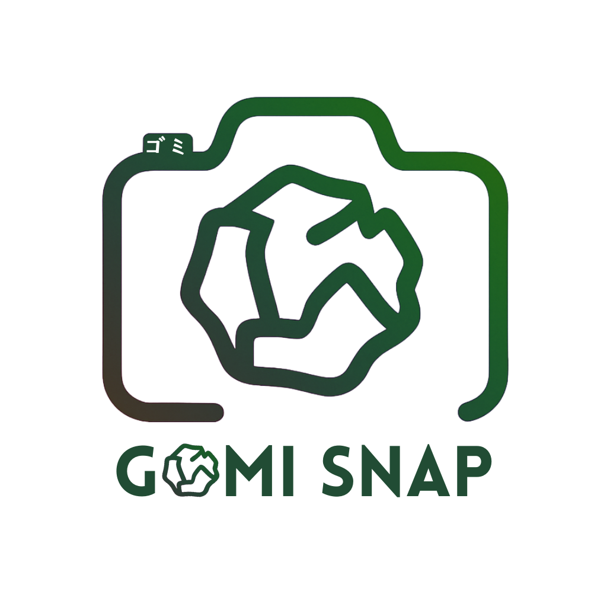

<div align="center">
  

  <h1>GOMI SNAP</h1>
  <p><strong>AI-Powered Trash Classification for Smarter Waste Disposal</strong></p>

  <p>
    
    
    
    
    
    
  </p>

  <p><em>Snap it. Sort it. Done.</em></p>
</div>

---

## Overview

GOMI SNAP helps users instantly identify the correct trash disposal category for any household item. Snap a photo, and receive disposal instructions in under 5 seconds — in your language, following your city's local rules.

Built by APU students for the **Hult Prize 2025**, GOMI SNAP addresses the very real challenge of improper waste sorting faced by international residents in Japan. Complex, municipality-specific recycling rules are a daily friction point — GOMI SNAP removes that friction entirely.

---

## Screenshots

> _Screenshots and demo videos will be added here._

| Main App | Camera Scan | Result Card | 3D Landing Page |
|----------|-------------|-------------|-----------------|
| _(coming soon)_ | _(coming soon)_ | _(coming soon)_ | _(coming soon)_ |

---

## Features

### Core
- **AI Image Recognition** — Powered by OpenAI GPT-4o Vision for accurate, real-time item identification
- **The 5-Second Rule** — Results delivered in under 5 seconds from photo to answer
- **Smart Clarification System** — Asks follow-up questions when context matters (e.g., "Is this paper contaminated with oil?")
- **Multi-Part Item Detection** — Breaks complex items into their components (e.g., PET bottle → body, cap, label — each in a different bin)

### Localization
- **6 Languages** — English, Japanese (日本語), Chinese Simplified (中文), Burmese (မြန်မာ), Korean (한국어), Indonesian (Bahasa)
- **Beppu City Disposal Rules** — Correctly applies local waste management regulations

### UX & Mobile
- **Mobile-First Design** — Optimized for on-the-go use with native camera integration via `react-webcam`
- **Trash Collection Schedule** — Set alarms and reminders for local pickup days
- **User Stats** — Track your daily and weekly scan activity
- **Feedback System** — Thumbs up/down on every result to improve accuracy

### Technical
- **Intelligent Image Caching** — Perceptual hashing (via Sharp) deduplicates visually similar images, reducing OpenAI API costs
- **GPS Location Zones** — Detects if user is on APU Campus or Downtown Beppu using the Haversine formula
- **Rate Limiting & Bot Detection** — Server-side protection on the classify endpoint
- **Admin Dashboard** — Analytics on scans, feedback, cache performance, and system health (key-protected)
- **3D Marketing Landing Page** — A Three.js + Framer Motion pitch page at `/3d`

---

## Disposal Categories (Beppu City)

| Category | Bag Color | Examples |
|----------|-----------|----------|
| Burnable | Yellow | Food waste, paper, textiles |
| Non-burnable | Blue | Ceramics, glass, small appliances |
| Recyclable Plastics | Pink | PET bottles, plastic containers |
| Recyclable Other | Green | Cans, glass bottles, cardboard |
| Oversized | Sticker | Furniture, large appliances |
| Hazardous | Special | Batteries, fluorescent bulbs |

---

## Tech Stack

### Frontend
| Technology | Purpose |
|------------|---------|
| React 18 + TypeScript | UI framework |
| Vite | Build tool & dev server |
| Tailwind CSS + Shadcn UI | Styling and component library |
| TanStack Query | Server state & data fetching |
| Framer Motion | Animations and transitions |
| Three.js | 3D landing page experience |
| Wouter | Client-side routing |
| Recharts | Admin analytics charts |
| react-webcam | Camera capture |

### Backend
| Technology | Purpose |
|------------|---------|
| Node.js + Express | HTTP server |
| OpenAI GPT-4o Vision API | AI image classification |
| PostgreSQL + Drizzle ORM | Database and schema management |
| Sharp | Image processing & perceptual hashing |
| Zod | Request validation |

---

## Project Structure

```
gomi-snap-portfolio/
├── client/                   # React frontend
│   ├── public/               # Static assets (logo, mockups, QR codes)
│   └── src/
│       ├── components/       # UI components (Camera, Results, Alarm, Feedback, etc.)
│       ├── pages/            # App routes (Home, AdminPage, Landing3D)
│       ├── lib/              # Utilities (translations, locationZones, queryClient)
│       ├── data/             # Static data (trash item examples)
│       └── hooks/            # Custom React hooks
├── server/                   # Node.js + Express backend
│   ├── index.ts              # Server entry point
│   ├── routes.ts             # API route definitions
│   ├── openai.ts             # GPT-4o Vision integration
│   ├── imageHash.ts          # Perceptual hashing for caching
│   ├── storage.ts            # Database access layer
│   ├── rateLimit.ts          # Rate limiting & bot detection
│   └── metrics.ts            # System health metrics
├── shared/
│   └── schema.ts             # Shared DB schema, types, and constants
└── package.json
```

---

## Getting Started

### Prerequisites

- Node.js 18+
- PostgreSQL database (or a [Neon](https://neon.tech) serverless instance)
- OpenAI API key with GPT-4o access

### Installation

```bash
# 1. Clone the repository
git clone <your-repo-url>
cd gomi-snap-portfolio

# 2. Install dependencies
npm install

# 3. Set up environment variables (see below)
cp .env.example .env

# 4. Push the database schema
npm run db:push

# 5. Start the development server
npm run dev
```

The app will be available at `http://localhost:5000`.

### Build for Production

```bash
npm run build
npm start
```

---

## Environment Variables

Create a `.env` file in the project root:

```env
# Required
OPENAI_API_KEY=sk-...        # OpenAI API key (GPT-4o Vision access required)
DATABASE_URL=postgresql://...  # PostgreSQL connection string

# Optional
ADMIN_KEY=...                 # Admin dashboard access key (minimum 16 characters)
NODE_ENV=development          # Set to "production" for deployments
```

| Variable | Required | Description |
|----------|----------|-------------|
| `OPENAI_API_KEY` | Yes | OpenAI API key for GPT-4o Vision |
| `DATABASE_URL` | Yes | PostgreSQL connection string |
| `ADMIN_KEY` | Recommended | Admin dashboard access key (16+ chars). If unset, admin is disabled in production. |

---

## API Endpoints

| Method | Endpoint | Description |
|--------|----------|-------------|
| `POST` | `/api/identify-trash` | Classify an item from a base64 image |
| `POST` | `/api/feedback` | Submit user feedback on a result |
| `GET` | `/api/admin/stats` | System health & metrics (admin-only) |
| `GET` | `/api/admin/feedback` | View all feedback entries (admin-only) |
| `GET` | `/api/admin/cache` | Image cache entries and hit rates (admin-only) |

---

## App Routes

| Route | Description |
|-------|-------------|
| `/` | Main app — camera, classification, schedule, stats |
| `/3d` | 3D marketing landing page (pitch/investor-facing) |
| `/admin` | Admin analytics dashboard (dev mode or valid `ADMIN_KEY` required) |

---

## Team

Built with passion by APU students for the **Hult Prize 2025** — the world's largest student competition for social entrepreneurship:

| Name | Role |
|------|------|
| **Sameer** | Founder & CEO/CTO |
| **Momoka** | Co-CEO |
| **Ellysen** | COO |
| **Makarem** | CFO |
| **Sami** | Videographer & Photographer |
| **Rania** | Head of Marketing |

**Campus Round Pitch**: January 11th, 2025 — Ritsumeikan Asia Pacific University, Beppu, Japan

---

## Roadmap

- [ ] Expand to additional cities and municipalities
- [ ] Offline mode with locally cached disposal rules
- [ ] Community-contributed disposal guides
- [ ] Gamification and environmental impact tracking
- [ ] Integration with municipal waste collection calendar APIs
- [ ] Native iOS & Android apps

---

## License

MIT — developed for the Hult Prize competition and educational purposes.

---

<div align="center">
  <strong>Made with care for our planet</strong><br/>
  APU · Beppu, Japan
</div>
